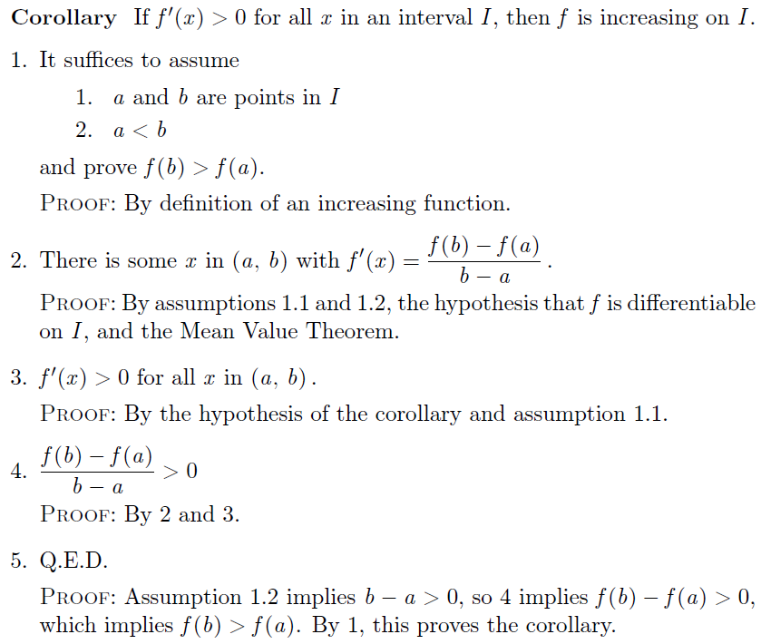

@(Cabinet)[howStudy_math|math_proving|published_blog]

[TOC]

# Structured Math Proof

> http://research.microsoft.com/en-us/um/people/lamport/pubs/proof.pdf

Admittedly, I'm not very good at math proof for now. Thus I have a strong desire to improve. 

## From `coq` to `Mathematica`

Last year, I tried to learn `coq` in the hope that proof assistant could magically help me to prove some theorems when doing machine learning research. However it is not mature enough to do useful proof in my field (e.g. Bayesian inference). 

Inspired by [*How to Write a 21st Century Proof*] by Leslie Lamport, I'm learning how to make my proofs more structural with the help of Mathematica notebooks. Also I will try to convert others' proofs in order to make them more easy to absorb. Well, in the original paper, he advocated `LTA`, which seems to be an overkill, as I won't use its proving engine for my case. 

## Structure and Naming

> Making proofs easier to understand is easy. It requires only the simple application of two principles: structure and naming. 

## Hierarchical Structure

> The best way I know to eliminate errors is to imagine that there is a curious child sitting next to us. Every time we write an assertion, the child asks: `Why`? 

The resulting proof is like the following:

The key is to add detailed `proof` at every step. This can be easily done by using Mathematica. 

I will start practicing this techniques. 